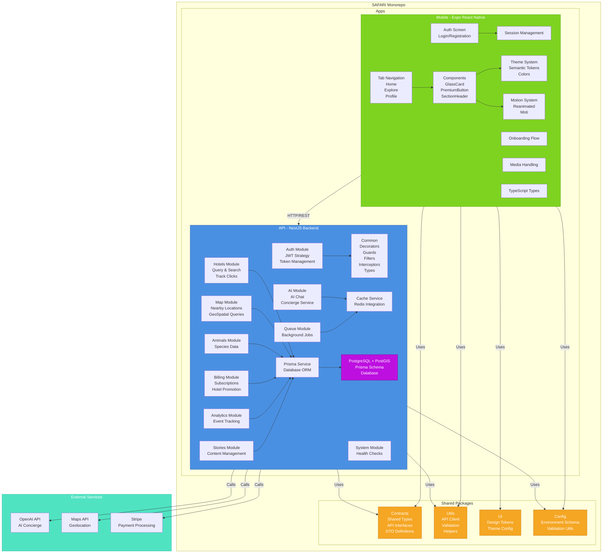

# Target Architecture — Phase 2/3
> Not for current implementation. Describes the NestJS + Expo + Prisma 
> monorepo structure to be initialized when Phase 1 validation gates are cleared.

```mermaid
graph TB
    subgraph MONOREPO["SAFARI Monorepo"]
        direction TB
        
        subgraph APPS["Apps"]
            subgraph API["API - NestJS Backend"]
                AUTH["Auth Module<br/>JWT Strategy<br/>Token Management"]
                AI["AI Module<br/>AI Chat<br/>Concierge Service"]
                HOTELS["Hotels Module<br/>Query & Search<br/>Track Clicks"]
                MAP["Map Module<br/>Nearby Locations<br/>GeoSpatial Queries"]
                ANIMALS["Animals Module<br/>Species Data"]
                BILLING["Billing Module<br/>Subscriptions<br/>Hotel Promotion"]
                ANALYTICS["Analytics Module<br/>Event Tracking"]
                CACHE["Cache Service<br/>Redis Integration"]
                PRISMA["Prisma Service<br/>Database ORM"]
                QUEUE["Queue Module<br/>Background Jobs"]
                STORIES["Stories Module<br/>Content Management"]
                SYSTEM["System Module<br/>Health Checks"]
                
                COMMON["Common<br/>Decorators<br/>Guards<br/>Filters<br/>Interceptors<br/>Types"]
                
                DB["PostgreSQL + PostGIS<br/>Prisma Schema<br/>Database"]
                
                AUTH --> COMMON
                AI --> CACHE
                HOTELS --> PRISMA
                MAP --> PRISMA
                ANIMALS --> PRISMA
                BILLING --> PRISMA
                ANALYTICS --> PRISMA
                QUEUE --> CACHE
                STORIES --> PRISMA
                PRISMA --> DB
            end
            
            subgraph MOBILE["Mobile - Expo React Native"]
                AUTH_SCREEN["Auth Screen<br/>Login/Registration"]
                ONBOARDING["Onboarding Flow"]
                TABS["Tab Navigation<br/>Home<br/>Explore<br/>Profile"]
                COMPONENTS["Components<br/>GlassCard<br/>PremiumButton<br/>SectionHeader"]
                THEME["Theme System<br/>Semantic Tokens<br/>Colors"]
                SESSION["Session Management"]
                MOTION["Motion System<br/>Reanimated<br/>Moti"]
                MEDIA["Media Handling"]
                TYPES["TypeScript Types"]
                
                AUTH_SCREEN --> SESSION
                TABS --> COMPONENTS
                COMPONENTS --> THEME
                COMPONENTS --> MOTION
            end
        end
        
        subgraph PACKAGES["Shared Packages"]
            CONTRACTS["Contracts<br/>Shared Types<br/>API Interfaces<br/>DTO Definitions"]
            UTILS["Utils<br/>API Client<br/>Validation<br/>Helpers"]
            UI["UI<br/>Design Tokens<br/>Theme Config"]
            CONFIG["Config<br/>Environment Schema<br/>Validation Utils"]
        end
    end
    
    subgraph EXTERNAL["External Services"]
        OPENAI["OpenAI API<br/>AI Concierge"]
        MAPS_API["Maps API<br/>Geolocation"]
        STRIPE["Stripe<br/>Payment Processing"]
    end
    
    API -->|Uses| CONTRACTS
    API -->|Uses| UTILS
    API -->|Uses| CONFIG
    
    MOBILE -->|Uses| CONTRACTS
    MOBILE -->|Uses| UTILS
    MOBILE -->|Uses| UI
    MOBILE -->|Uses| CONFIG
    
    MOBILE -->|HTTP/REST| API
    
    API -->|Calls| OPENAI
    API -->|Calls| MAPS_API
    API -->|Calls| STRIPE
    
    style API fill:#4a90e2,stroke:#2c5aa0,color:#fff
    style MOBILE fill:#7ed321,stroke:#5aa30f,color:#fff
    style CONTRACTS fill:#f5a623,stroke:#c77f1b,color:#fff
    style UTILS fill:#f5a623,stroke:#c77f1b,color:#fff
    style UI fill:#f5a623,stroke:#c77f1b,color:#fff
    style CONFIG fill:#f5a623,stroke:#c77f1b,color:#fff
    style DB fill:#bd10e0,stroke:#7a0888,color:#fff
    style EXTERNAL fill:#50e3c2,stroke:#25b89a,color:#fff
```